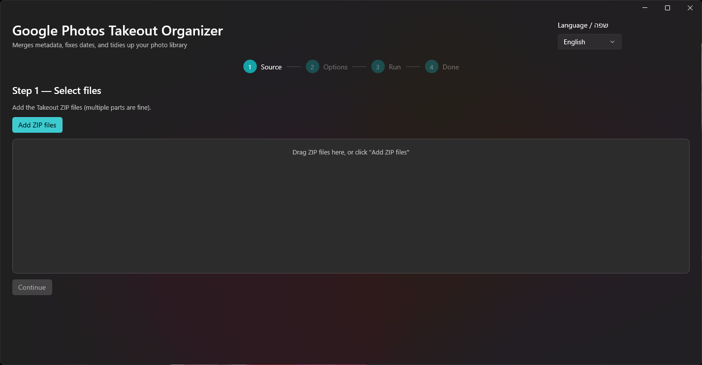
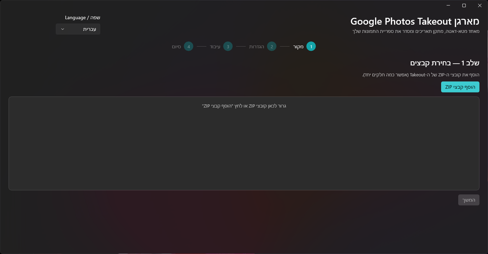

<div align="right">

**עברית** · [English](README.md)

</div>

<div align="center">

# מארגן Google Photos Takeout

**ממזג את מטא-הדאטה של Google Photos Takeout חזרה לתוך התמונות — תאריכים נכונים, אזורי זמן, כפילויות ואלבומים — ומפיק ספרייה נקייה ומאורגנת.**

[](https://github.com/itielbru/gphotos-takeout-organizer/actions/workflows/ci.yml)
[](https://codecov.io/gh/itielbru/gphotos-takeout-organizer)
[](LICENSE)
[](https://github.com/itielbru/gphotos-takeout-organizer/releases)
[](https://dotnet.microsoft.com/)



</div>

## מה הכלי עושה

Google Photos Takeout מייצא את הספרייה שלך כקבצי ZIP שבהם המטא-דאטה האמיתי שמור בקובצי `.json` **ליד** כל תמונה — לא בתוכה. רוב הכלים מתעלמים מקבצים אלה, וכתוצאה מכך מתקבלים תאריכים שגויים ותיאורים שאבדו. הכלי הזה פותר זאת:

- **איחוד מחדש של מטא-דאטה** — כותב את התאריך המקורי, ה-GPS והתיאור מה-JSON של Takeout **פנימה** לתוך ה-EXIF/XMP של כל קובץ (באמצעות ExifTool), כך שכל אפליקציית תמונות תקרא אותם נכון.
- **תאריכים נכונים עם אזור זמן** — `photoTakenTime` הוא UTC; הזמן המקומי ו-`OffsetTimeOriginal` נגזרים מה-GPS, ווידאו מקבל `QuickTime:CreateDate` נכון.
- **התאמה חסינה לשגיאות** — מטפל בשמות `*.supplemental-metadata.json` קטועים של גוגל ([Issue #353](https://github.com/TheLastGimbus/GooglePhotosTakeoutHelper/issues/353)), גרסאות `-edited`/`(N)` ו-Live/Motion Photo — לפי קידומת, לא לפי מספרים קסומים.
- **ביטול כפילויות אטומי** — ביטול כפילויות מבוסס hash-תוכן שהוא race-free תחת מקביליות מלאה.
- **ארגון אלבומים** — יוצר מחדש אלבומים באמצעות symlink → hardlink → copy כ-fallback.
- **בטוח לנתיבים ארוכים**, תומך במספר ארכיונים, ניתן לחידוש, עם תצוגה מקדימה של dry-run.
- **ממשק דו-לשוני** — עברית (RTL) ואנגלית (LTR), ניתן להחלפה בזמן אמת.

## התקנה מהירה

<div align="center">

[](https://github.com/itielbru/gphotos-takeout-organizer/releases/latest)

**Windows 10 / 11**

| | 🏆 קובץ התקנה (מומלץ) | אפליקציה ניידת (ZIP) | שורת פקודה (CLI) |
|:--|:--|:--|:--|
| הורדה | [⬇ גרסה אחרונה](https://github.com/itielbru/gphotos-takeout-organizer/releases/latest) | [⬇ גרסה אחרונה](https://github.com/itielbru/gphotos-takeout-organizer/releases/latest) | [⬇ גרסה אחרונה](https://github.com/itielbru/gphotos-takeout-organizer/releases/latest) |
| הקובץ שצריך | `GPhotosTakeout-Setup-<version>-win-x64.exe` | `GPhotosTakeout-App-<version>-win-x64.zip` | `gptakeout-<version>-win-x64.exe` |

</div>

כל הקבצים נמצאים באותו עמוד [הגרסה האחרונה](https://github.com/itielbru/gphotos-takeout-organizer/releases/latest) — תבחרו את מה שמתאים לכם.

- **קובץ התקנה** (הכי פשוט): הריצו את `GPhotosTakeout-Setup-…-win-x64.exe` ולחצו הלאה. מתקין לחשבון המשתמש (בלי הרשאות אדמין), מוסיף קיצור לתפריט התחלה, כולל גם את ה-CLI, ורושם מסיר-התקנה. בהרצה הראשונה לחצו על **התקן את ExifTool** כדי לאפשר כתיבת מטא-דאטה (הורדה חד-פעמית של ~10MB). כל שאר היכולות עובדות גם בלעדיו. לאחר מכן: הוסיפו את קובצי ה-Takeout → בחרו אפשרויות → הריצו.
- **אפליקציה ניידת** (ללא התקנה): חלצו את `GPhotosTakeout-App-…-win-x64.zip`, ואז הריצו את `GPhotosTakeout.App.exe` שבתוך התיקייה שחולצה. אותה אפליקציה בדיוק, בלי קיצורים ובלי מסיר-התקנה.
- **CLI** (אוטומציה/סקריפטים): הריצו את `gptakeout-…-win-x64.exe` משורת הפקודה — ראו בהמשך. קובץ יחיד עצמאי, בלי ZIP.

> **הערת SmartScreen:** הקבצים אינם חתומים דיגיטלית, ולכן בהרצה הראשונה Windows עשוי להציג
> אזהרה. לחצו **More info → Run anyway** כדי להמשיך. זה נורמלי לאפליקציות קוד פתוח ללא חתימה.
>
> **למה האפליקציה הניידת היא ZIP ולא EXE יחיד:** מצב `PublishSingleFile` של WinUI 3 לאפליקציות
> unpackaged קורס בהרצה הראשונה אצל כל משתמש ([microsoft/WindowsAppSDK#2597](https://github.com/microsoft/WindowsAppSDK/issues/2597))
> — באג ידוע ופתוח ב-Microsoft, לא משהו שאפשר לתקן ברמת הריפו הזה. ל-CLI אין תלות ב-XAML/WindowsAppSDK, אז EXE יחיד עובד בשבילו ללא בעיה. קובץ ההתקנה עוקף את הבעיה לגמרי — הוא מתקין את תיקיית האפליקציה בשבילכם.

### שורת פקודה (headless)

הורידו את `gptakeout-<version>-win-x64.exe` מ-[הגרסה האחרונה](https://github.com/itielbru/gphotos-takeout-organizer/releases/latest) והריצו אותו ישירות:

```powershell
# תצוגה מקדימה — מתכנן ומדווח בלי לכתוב כלום
.\gptakeout-<version>-win-x64.exe -i takeout-001.zip -o C:\Photos --dry-run --report plan.json

# ריצה אמיתית עם דוח CSV
.\gptakeout-<version>-win-x64.exe -i takeout-001.zip -i takeout-002.zip -o C:\Photos --report report.csv

# עזרה מלאה
.\gptakeout-<version>-win-x64.exe --help
```

טיפ: אפשר לשנות את שם הקובץ ל-`gptakeout.exe` (או להוסיף אותו ל-`PATH`) כדי להתאים לפקודות הקצרות
יותר שמופיעות ב-[docs/cli-cookbook.md](docs/cli-cookbook.md).

דגלים עיקריים: `--structure yearmonth|albums|flat`, `--albums`, `--duplicates`,
`--timezone <IANA>`, `--no-metadata`, `--exiftool <path>`, `--dry-run`, `--report <.json|.csv>`,
`--log <path>`, `--no-log`, `-v`.

קודי יציאה: `0` הצלחה · `1` הושלם עם שגיאות · `2` קלט לא תקין · `3` שגיאה קטלנית · `64` בוטל.

## ExifTool

האפליקציה מתקינה בנייה מוצמדת של [ExifTool](https://exiftool.org) בהרצה הראשונה בלחיצה אחת
(לתוך `%LocalAppData%\GPhotosTakeout\Tools`). ה-CLI משתמש באותה התקנה אוטומטית, או שאפשר להעביר `--exiftool <path>`. ללא ExifTool, האפליקציה עדיין מארגנת ומתארכת קבצים, אבל לא תכתוב metadata לתוכם.

## מבנה הפלט

```
YearMonth (ברירת מחדל)         Albums                   Flat
──────────────────────────     ─────────────────────    ────────────────────
output/                        output/                  output/
└── ALL_PHOTOS/                ├── קיץ 2023/            └── ALL_PHOTOS/
    ├── 2023/                  │   └── IMG_001.jpg          ├── IMG_001.jpg
    │   ├── 2023-07/           └── משפחה/                   └── IMG_002.jpg
    │   │   └── IMG_001.jpg        └── IMG_002.jpg
    │   └── 2023-08/
    │       └── IMG_002.jpg
    └── Undated/
        └── IMG_ללא_תאריך.jpg
```

תיקיות מיוחדות (Archive, Trash, Locked Folder) תמיד מופרדות לתת-ספרייה משלהן בראש הפלט, ללא תלות במבנה הנבחר.

## השוואת אסטרטגיות אלבום

| אסטרטגיה | שימוש בדיסק | דרישות | תמיכה באפליקציות תמונות |
|----------|------------|---------|-------------------------|
| Shortcut (symlink → hardlink → copy) | ללא (אלא אם copy) | Developer Mode עבור symlinks | משתנה |
| Duplicate | כפול | — | תמיד עובד |
| JSON Manifest (`albums.json` בשורש הפלט) | ללא | מנתח ייחודי | ידני |
| Nothing | ללא | — | ללא ארגון אלבומים |

`Shortcut` הוא ברירת המחדל: מנסה symlink קודם, נופל ל-hardlink באותו כונן, ואז מעתיק. שרשרת ה-fallback אוטומטית לחלוטין.

## בנייה מהמקור

```powershell
# בדיקות (Core)
dotnet test tests/GPhotosTakeout.Tests/GPhotosTakeout.Tests.csproj

# אפליקציה (חובה לציין פלטפורמה — x64 או ARM64)
dotnet build src/GPhotosTakeout.App/GPhotosTakeout.App.csproj -p:Platform=x64
```

נדרש **.NET 9 SDK**. ראה [CONTRIBUTING.md](CONTRIBUTING.md) להגדרת סביבת הפיתוח המלאה
(כולל התקנת ExifTool מקומית) ו-[ARCHITECTURE.md](ARCHITECTURE.md) לתכנון המנוע, מודל המקביליות ואסטרטגיית ה-matching/date/timezone.

## צילומי מסך

| אנגלית (LTR) | עברית (RTL) |
|:---:|:---:|
|  |  |

הממשק דו-לשוני לחלוטין וניתן להחלפה בזמן אמת — כל הפריסה מתהפכת לעברית.

## מבנה הפרויקט

```
GPhotosTakeout.sln
├─ src/GPhotosTakeout.Core/   לוגיקת העיבוד (ללא תלות ב-UI, נבדקת ב-unit tests)
│   ├─ Archives/   אינדוקס + streaming מתוך ה-ZIP, איחוד חלקים, נעילה פר-ארכיון
│   ├─ Matching/   התאמת מדיה↔JSON כולל Issue #353 (supplemental-metadata קטוע)
│   ├─ Metadata/   מנוע ExifTool ב-batch mode (-stay_open, פרוטוקול {ready}) + pool
│   ├─ Dates/      היררכיית תאריך + timezone מ-GPS (offset נכון)
│   ├─ Dedup/      זיהוי כפילויות אטומי מבוסס hash
│   ├─ Albums/     קישור אלבומים: symlink → hardlink → copy
│   ├─ IO/         תמיכת נתיבים ארוכים (\\?\)
│   └─ Pipeline/   אורקסטרציה, מקביליות, resume, progress
├─ src/GPhotosTakeout.App/    אפליקציית WinUI3 (Unpackaged, עברית/אנגלית)
├─ src/GPhotosTakeout.Cli/    הרצה headless (gptakeout) — אוטומציה, batch
└─ tests/GPhotosTakeout.Tests/  בדיקות (matching, dates, dedup, pipeline, מקביליות,
                                 ולידציה, dry-run, ExifTool resilience, long-path, archives, timezone, albums)
```

## תיעוד

- [ROADMAP.he.md](ROADMAP.he.md) — התוכנית המדורגת למוצר מלוטש ומוגמר, עם עדיפויות וקריטריוני קבלה.
- [ARCHITECTURE.md](ARCHITECTURE.md) — תכנון המנוע, מודל המקביליות, טריק ה-#353, היררכיית תאריך/timezone.
- [CONTRIBUTING.md](CONTRIBUTING.md) — בנייה, בדיקות, ותהליך התרומה.
- [SECURITY.md](SECURITY.md) — מדיניות אבטחה (ללא טלמטריה; מעבד קבצים מקומית).
- [docs/troubleshooting.md](docs/troubleshooting.md) — תאריכים שגויים, קבצים חסרים, בעיות ExifTool, Live Photos, קודי יציאה.
- [docs/cli-cookbook.md](docs/cli-cookbook.md) — מתכונים ל-CLI: dry-run, סקריפטים אוטומטיים, ניתוח דוחות, טיפול בקודי יציאה.
- [docs/performance.md](docs/performance.md) — כוונון `--cpu`, `--exif-parallel`, ועצות לדאטאסטים גדולים ויעדי NAS.
- [DEVELOPMENT.md](DEVELOPMENT.md) — יומן פיתוח (עברית).

## בעיות ותמיכה

דיווחי באגים ובקשות לתכונות נקראים ומטופלים ברצינות. אם משהו לא עובד — תאריכים שגויים, קבצים חסרים, קריסה — פתחו [issue](https://github.com/itielbru/gphotos-takeout-organizer/issues) עם פרטים: גרסת Windows, איזה Takeout גרם לבעיה, ושורות רלוונטיות מקובץ הלוג (`%LocalAppData%\GPhotosTakeout\logs\`). כל דיווח מקבל מענה.

לבעיות אבטחה — השתמשו ב-[דיווח פרטי](https://github.com/itielbru/gphotos-takeout-organizer/security/advisories/new) במקום issue ציבורי.

## רישיון

[MIT](LICENSE) © 2026 Itiel Bru.
